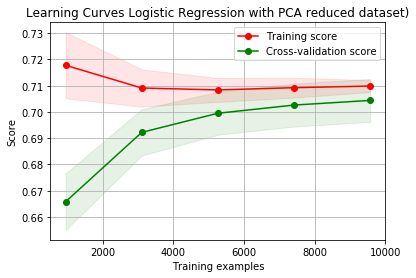

<center>

# Forest Cover Type Prediction
    Spring 2019 

</center>


## Introduction
Can we predict the type of tree cover given cartographic data such as elevation, hydrologic, sunlight and soil data? 
This project attempts to predict the predominant type of tree in sections of wooded areas. 

Understanding forest composition is a valuable aspect of managing the health and vitality of our wilderness
areas. Classifying cover type can help further research regarding forest fire susceptibility and de/re-forestation concerns. 

The data used in this report was taken from the [UCI Machine Learning Repository](http://archive.ics.uci.edu/ml/index.php). The data set consists of 15,120 samples 
of 30m x 30m patches of forest located in northern Colorado’s Roosevelt National Forest. . These areas represent forests with minimal
human-caused disturbances, so forest covers are more a result of ecological processes than forest management
practices. 


The study area includes four wilderness areas located in the Roosevelt National Forest of northern Colorado. Each observation is a 30m x 30m patch. We will be predicting an integer classification for the forest cover type. The seven types are:  

	1. Spruce/Fir
	2. Lodgepole Pine  
	3. Ponderosa Pine  
	4. Cottonwood/Willow  
	5. Aspen  
	6. Douglas-fir  
	7. Krummholz  

The training set (15120 observations) contains both features and the Cover_Type.   
The complete code can be found [here](https://github.com/dasaditi/machineLearning/tree/master/forestCover).

### Data Fields 

Name | Unit of Measurement | Description
---|---|-----
Elevation | meters | Elevation
Aspect|degrees azimuth | Aspect
Slope | degrees | Slope
Horizontal_Distance_To_Hydrology | meters |Horz Dist to nearest surface water features
Vertical_Distance_To_Hydrology | meters |Vert Dist to nearest surface water features
Horizontal_Distance_To_Roadways | meters |Horz Dist to nearest roadway
Hillshade_9am | (0 to 255 index) | Hillshade index at 9am, summer solstice
Hillshade_Noon | (0 to 255 index) | Hillshade index at noon, summer solstice
Hillshade_3pm | (0 to 255 index) | Hillshade index at 3pm, summer solstice
Horizontal_Distance_To_Fire_Points | meters |Horz Dist to nearest wildfire ignition points
Wilderness_Area |(4 binary columns, 0 = absence or 1 = presence) | Wilderness area designation
Soil_Type |(40 binary columns, 0 = absence or 1 = presence) | Soil Type designation
Cover_Type |(7 types, integers 1 to 7) | Forest Cover Type designation

## Understanding the dependencies in the features

Hillshade at time t varies as a factor of:
cos(slope)cos(90−Altitude)+sin(slope)sin(90−Altitude)cos(Azimuth−Aspect)
where Altitude is the angle of the Sun relative to the horizon and Azimuth relates to the direction the Sun is facing:
North, South, East, or West. Azimuth of 90 degrees corresponds to East.

This equation actually arises from a theorem in Spherical geometry known as “Spherical law of Cosines” relating the sides 
and angles of triangles constructed on spherical surfaces.

In a unit sphere, lengths a, b, c correspond to the angle subtended by those sides from the center of the sphere. 
If we know the two sides a, b and the angle between them C, then the cosine of c, is given by:

> In short, the Illumination of the patch(Hillshade) is related to alitude of the sun, slope of the terrain and 
the aspect.More details can be found in [How Hillshade works](http://desktop.arcgis.com/en/arcmap/10.3/tools/spatial-analyst-toolbox/how-hillshade-works.htm).We might have features like Aspect, Slope and HillShade that provides similar information.


The azimuth is the angular direction of the sun, measured from north in clockwise degrees from 0 to 360. An azimuth of 90 degrees is east. The default azimuth is 315 degrees (NW).

The altitude is the slope or angle of the illumination source above the horizon. The units are in degrees, from 0 (on the horizon) to 90 (overhead). The default is 45 degrees.

<center></center>

## Modeling Approach
Here is the overview of our approach in finding the forest covers.  

<center></center>

## Fetch the dataset


```python
df = pd.read_csv('data/train.csv', engine='c')
df.head()
```

<p>5 rows × 56 columns</p>


## Initial Data Analysis

First, we are interested to know if there are any missing values in the data, the data types of the features, and whether or not the labels have a balanced distribution.

#### Determine Shape and Size


```python
#Check the shape and Size of the data
df.shape
```


    (15120, 56)


#### Determine Missing Values


```python
# No missing values
df[df.isnull().any(axis=1)]
```


<div>
<p>0 rows × 56 columns</p>
</div>


#### Change the index to Id


```python
#Setting the Id as index might help in fetching data easier
df.set_index('Id',inplace=True)
```

#### Check if there is a bias on the labels


```python
df["Cover_Type"].value_counts()
## No bias . All have equal records
```


    7    2160
    6    2160
    5    2160
    4    2160
    3    2160
    2    2160
    1    2160
    Name: Cover_Type, dtype: int64


**Here are our high level observations:**
* There are total 15120 records in the training set with 55 independent features.
* There are no missing values in the dataset.
* The kaggle training data was not a simple random sample of the entire dataset,but a stratified sample of the seven forest classes. The training data was equally distributed among the seven classes. 
* All the fields are of integer data-type.

## Split the Dataset into train and validation

We split the data into test and validation sets before doing further exploratory data analysis.  Exploratory data Analysis will be done on the training set.


```python
#Now split the data randomly into train and validation set 
X=df.drop(['Cover_Type'], axis = 1)
y = df['Cover_Type']
X_train, X_val, y_train, y_val = train_test_split(
            X, y, test_size=0.20, random_state=42,stratify=y)
print("The shape of validation data:{} and {} ".format(X_val.shape,y_val.shape))
print("The shape of training data:{} and {} ".format(X_train.shape,y_train.shape))
# Added the label temporariliy for EDA
X_train['Cover_Type']=y_train


```

    The shape of validation data:(3024, 54) and (3024,) 
    The shape of training data:(12096, 54) and (12096,) 


## Exploratory Data Analysis

### Plot data 
**A. Boxplots distribution for the continuous fatures.**   This will give us an idea of the outliers if any.


```python
cmap = sns.color_palette("Set2")

def boxPlot(first_feature, sec_feature):
    sns.boxplot(x=first_feature, y=sec_feature, data=X_train, palette=cmap, width=0.5);

f = plt.figure(figsize=(25,20))
f.add_subplot(331)
boxPlot('Cover_Type','Elevation')
f.add_subplot(332)
boxPlot('Cover_Type','Slope')
f.add_subplot(333)
boxPlot('Cover_Type','Vertical_Distance_To_Hydrology')
f.add_subplot(334)
boxPlot('Cover_Type','Horizontal_Distance_To_Hydrology')
f.add_subplot(335)
boxPlot('Cover_Type','Horizontal_Distance_To_Roadways')
f.add_subplot(336)
boxPlot('Cover_Type','Horizontal_Distance_To_Fire_Points')
f.add_subplot(337)
boxPlot('Cover_Type','Hillshade_9am')
f.add_subplot(338)
boxPlot('Cover_Type','Hillshade_Noon')
f.add_subplot(339)
boxPlot('Cover_Type','Hillshade_3pm')

```


>Looking at the data distribution in the context of class seperation, elevation could be the most significant factor in determining cover type. Also, apart from elevation the rest of the features are almost similarly distributed between CoverType1 and CoverType2.


**B. Histogram distribution of continuous features**
Let's look at the underlying data distribution of each column and see if they follow a normal distribution. Based on that, we will decide whether to identify outliers by z-score or by IQR.


```python
def histPlot(first_feature,col):
    sns.distplot(first_feature,color=col);

f = plt.figure(figsize=(20,15))
f.add_subplot(331)
histPlot(X_train['Elevation'],'olivedrab')
f.add_subplot(332)
histPlot(X_train['Slope'],'c')
f.add_subplot(333)
histPlot(X_train['Vertical_Distance_To_Hydrology'],'forestgreen')
f.add_subplot(334)
histPlot(X_train['Horizontal_Distance_To_Hydrology'],'darkcyan')
f.add_subplot(335)
histPlot(X_train['Horizontal_Distance_To_Roadways'],'olive')
f.add_subplot(336)
histPlot(X_train['Horizontal_Distance_To_Fire_Points'],'teal')
f.add_subplot(337)
histPlot(X_train['Hillshade_9am'],'coral')
f.add_subplot(338)
histPlot(X_train['Hillshade_Noon'],'greenyellow')
f.add_subplot(339)
histPlot(X_train['Hillshade_3pm'],'darkorange')
```


### Finding Outliers
>Since not all the features follow a normal distribution, we will use the IQR to find outliers. We are using 3 times the IQR for each feature to identify the outliers.


```python
#Find outliers
from numpy import percentile
import itertools
def findCutOff(feature):
    #print(feature.index[feature>20])
    q25, q75 = percentile(feature, 25), percentile(feature, 75)
    iqr = q75 - q25
    # calculate the outlier cutoff
    cut_off = iqr * 3
    lower, upper = q25 - cut_off, q75 + cut_off
    #return lower, upper
    return feature.index[(feature<lower)|(feature>upper)].tolist()


all_outliers=[]
#outliers
slope= X_train.groupby('Cover_Type')['Slope'].agg(findCutOff)
merged_slope = list(itertools.chain.from_iterable(slope))
all_outliers.append(merged_slope)
#Vertical_Distance_To_Hydrology
vh=X_train.groupby('Cover_Type')['Vertical_Distance_To_Hydrology'].agg(findCutOff)
merged_vh = list(itertools.chain.from_iterable(vh))
all_outliers.append(merged_vh)

#Horizontal_Distance_To_Hydrology
hh=(X_train.groupby('Cover_Type')['Horizontal_Distance_To_Hydrology'].agg(findCutOff))
merged_hh = list(itertools.chain.from_iterable(hh))
all_outliers.append(merged_hh)

#Horizontal_Distance_To_Roadways
hr=(X_train.groupby('Cover_Type')['Horizontal_Distance_To_Roadways'].agg(findCutOff))
merged_hr = list(itertools.chain.from_iterable(hr))
all_outliers.append(merged_hr)

#Horizontal_Distance_To_Fire_Points
hf=X_train.groupby('Cover_Type')['Horizontal_Distance_To_Fire_Points'].agg(findCutOff)
merged_hf = list(itertools.chain.from_iterable(hf))
all_outliers.append(merged_hf)

#Hillshade_9am
h9=(X_train.groupby('Cover_Type')['Hillshade_9am'].agg(findCutOff))
merged_h9 = list(itertools.chain.from_iterable(h9))
all_outliers.append(merged_h9)

#Hillshade_Noon
hn=(X_train.groupby('Cover_Type')['Hillshade_Noon'].agg(findCutOff))
merged_hn = list(itertools.chain.from_iterable(hn))
all_outliers.append(merged_hn)

#Hillshade_Noon
h3=(X_train.groupby('Cover_Type')['Hillshade_3pm'].agg(findCutOff))
merged_h3 = list(itertools.chain.from_iterable(h3))
all_outliers.append(merged_h3)
all_outliers = list(itertools.chain.from_iterable(all_outliers))
print("Total number of outliers: ",len(all_outliers))
print("Total number of outliers by cover type: ")
unique_index=np.unique(all_outliers)

X_train.loc[unique_index,:].Cover_Type.value_counts()
#X_train.loc[unique_index,:][X_train.Cover_Type==5].iloc[:,df.columns.str.startswith('Soil')].sum()

```

    Total number of outliers:  144
    Total number of outliers by cover type: 
    5    74
    2    32
    1    21
    7     6
    6     1
    Name: Cover_Type, dtype: int64


#### Observations of outliers
There are total of 144 outliers
1. Most of the Outliers are in Wilderness_Area1, some are in Wilderness_Area3
2. Outliers are found in Soil_Type18, Soil_Type29, and Soil_Type30
3. Most of the outliers are from Cover_Types 5, 2, and 1. There are 6 records of Cover_Type=7 and one record of Cover_Type=6
4. We remove the outliers before modelling under the assumption that their removal will improve model performance.

### Removing Outliers
Before doing the modeling we removed the outliers


```python
# Let's see if deleting the outliers helps or not
X_train.drop(unique_index,axis='rows',inplace=True)
y_train.drop(unique_index,axis='rows',inplace=True)

```
    
**C. Scatterplots, comparsion among the independent variable.**  
**Aspect vs. Hillshade** Aspect is the orientation of slope, measured clockwise in degrees from 0 to 360, where 0 is north-facing, 90 is east-facing, 180 is south-facing, and 270 is west-facing. Let's look at aspect vs Hillshade .


```python

classes = np.array(list(X_train.Cover_Type.values))

def plotRelation(first_feature, sec_feature,cmap='viridis'):
    plt.scatter(first_feature, sec_feature, c = classes, s=10,cmap=cmap)
    plt.xlabel(first_feature.name)
    plt.ylabel(sec_feature.name)
    
f = plt.figure(figsize=(25,6))
f.add_subplot(131)
plotRelation( X_train.Aspect,X_train.Hillshade_9am)
f.add_subplot(132)
plotRelation(X_train.Aspect,X_train.Hillshade_Noon)
f.add_subplot(133)
plotRelation(X_train.Aspect,X_train.Hillshade_3pm)

```


255 is brightest light for hillshade and it is directly correlated to Aspect direction. Maybe these two variables can be merged to one with some equtaion.  

>There is 1 record of Hillshade_9am with a zero value and around 70 records of Hillshade_3pm with zero values. But as per the [calculation of Hillshade](http://desktop.arcgis.com/en/arcmap/10.3/tools/spatial-analyst-toolbox/how-hillshade-works.htm), 0 values are appropriate. Hence we kept the values as is.

#### D. Slope vs Hillshade


```python
f = plt.figure(figsize=(25,20))
f.add_subplot(331)
plotRelation( X_train.Slope,X_train.Hillshade_9am,cmap='PiYG')
f.add_subplot(332)
plotRelation(X_train.Slope,X_train.Hillshade_Noon,cmap='PiYG')
f.add_subplot(333)
plotRelation(X_train.Slope,X_train.Hillshade_3pm,cmap='PiYG')

```


#### E. Relationship between elevation and distance to everything**  


```python
f = plt.figure(figsize=(25,20))
f.add_subplot(331)
plotRelation( X_train.Elevation,X_train.Vertical_Distance_To_Hydrology,cmap='PuBuGn')
f.add_subplot(332)
plotRelation(X_train.Elevation,X_train.Horizontal_Distance_To_Hydrology,cmap='PuBuGn')
f.add_subplot(333)
plotRelation(X_train.Elevation,X_train.Horizontal_Distance_To_Roadways,cmap='PuBuGn')
f.add_subplot(334)
plotRelation(X_train.Elevation,X_train.Horizontal_Distance_To_Fire_Points,cmap='PuBuGn')
f.add_subplot(335)
plotRelation(X_train.Elevation,X_train.Slope,cmap='PuBuGn')


```


#### F. Soil type
Let's look at the distribution of the soil type. There are 40 soli types in the dataset.


```python
soil_dummies = X_train.loc[:,X_train.columns.str.startswith('Soil_Type')]
#wild = wild_dummies.idxmax(axis=1)
soil = soil_dummies.idxmax(axis=1)
#wild.name = 'Wilderness'
soil.name = 'Soil'
X_train['Soil'] = soil
plt.figure(figsize=(12,5))
sns.countplot(x='Soil',data=X_train,palette=cmap);
plt.xticks(rotation=90);
```


>Soil types 7 and 15 do have any records.  Hence they can be deleted.

Also, we think it may be appropriate to merge the soil types into smaller buckets based on broader soil characteristics.  

* Stony - 1-2, 6,9,12,18,24-34, 36-40  
* Rubly - 3,4,5,10,11,13  
* Other - 7,8,14-17,19,20,21,22,,23  


```python
X_train.drop(['Soil_Type7','Soil_Type15'],axis='columns',inplace=True)
X_val.drop(['Soil_Type7','Soil_Type15'],axis='columns',inplace=True)

```

#### G. Vertical distance to hydrology 
Some of the variables are negative. Since we believe vertical distance should not be negative, we convert the vertical distances to absolute value.


```python
X_train['Vertical_Distance_To_Hydrology'] = abs(X_train['Vertical_Distance_To_Hydrology'] )
X_val['Vertical_Distance_To_Hydrology'] = abs(X_val['Vertical_Distance_To_Hydrology'] )
```

#### H. Correlation Heat Map
We do observe a strong correlation between hillshade and aspect as described in the section "Understanding the Feature Dependencies" above. 


```python
#Defining the number of features for the Correlation Heat Map
size = 10
corrmat = X_train.iloc[:,:size].corr()
f, ax = plt.subplots(figsize = (10,8))
sns.heatmap(corrmat,vmax=0.8,square=True);
```


#### H. Correlation Values
We do observe some strong correlations as folllows: 

   1. Aspect is highly correlated to Hillshade_9am and Hillshade_3pm

   2. Horizontal distance to hydrology is highly correlated to Vertical Distance to Hydrology

   3. Slope and Hillshade_Noon

   4. Elevation and Horizontal Distance to Roadways 

Our hypothesis is that the feature selection process later in this notebook will allow us to determine which of the highly correlated features should be dropped from our feature set, if any.


```python
data = X_train.iloc[:,:size]

# Get name of the columns
cols = data.columns

# Calculate the pearson correlation coefficients for all combinations
data_corr = data.corr()
print(data_corr)
```

                                        Elevation    Aspect     Slope  \
    Elevation                            1.000000 -0.009200 -0.322866   
    Aspect                              -0.009200  1.000000  0.021589   
    Slope                               -0.322866  0.021589  1.000000   
    Horizontal_Distance_To_Hydrology     0.407018  0.042554 -0.056419   
    Vertical_Distance_To_Hydrology       0.127989  0.044631  0.278980   
    Horizontal_Distance_To_Roadways      0.582442  0.064460 -0.286204   
    Hillshade_9am                        0.100019 -0.592402 -0.195054   
    Hillshade_Noon                       0.226805  0.333081 -0.606347   
    Hillshade_3pm                        0.094159  0.636480 -0.325894   
    Horizontal_Distance_To_Fire_Points   0.462559 -0.044996 -0.240623   
    
                                        Horizontal_Distance_To_Hydrology  \
    Elevation                                                   0.407018   
    Aspect                                                      0.042554   
    Slope                                                      -0.056419   
    Horizontal_Distance_To_Hydrology                            1.000000   
    Vertical_Distance_To_Hydrology                              0.675927   
    Horizontal_Distance_To_Roadways                             0.195507   
    Hillshade_9am                                              -0.032985   
    Hillshade_Noon                                              0.081131   
    Hillshade_3pm                                               0.080426   
    Horizontal_Distance_To_Fire_Points                          0.165204   
    
                                        Vertical_Distance_To_Hydrology  \
    Elevation                                                 0.127989   
    Aspect                                                    0.044631   
    Slope                                                     0.278980   
    Horizontal_Distance_To_Hydrology                          0.675927   
    Vertical_Distance_To_Hydrology                            1.000000   
    Horizontal_Distance_To_Roadways                          -0.005285   
    Hillshade_9am                                            -0.078955   
    Hillshade_Noon                                           -0.146151   
    Hillshade_3pm                                            -0.058245   
    Horizontal_Distance_To_Fire_Points                       -0.010683   
    
                                        Horizontal_Distance_To_Roadways  \
    Elevation                                                  0.582442   
    Aspect                                                     0.064460   
    Slope                                                     -0.286204   
    Horizontal_Distance_To_Hydrology                           0.195507   
    Vertical_Distance_To_Hydrology                            -0.005285   
    Horizontal_Distance_To_Roadways                            1.000000   
    Hillshade_9am                                             -0.004727   
    Hillshade_Noon                                             0.250196   
    Hillshade_3pm                                              0.180189   
    Horizontal_Distance_To_Fire_Points                         0.510466   
    
                                        Hillshade_9am  Hillshade_Noon  \
    Elevation                                0.100019        0.226805   
    Aspect                                  -0.592402        0.333081   
    Slope                                   -0.195054       -0.606347   
    Horizontal_Distance_To_Hydrology        -0.032985        0.081131   
    Vertical_Distance_To_Hydrology          -0.078955       -0.146151   
    Horizontal_Distance_To_Roadways         -0.004727        0.250196   
    Hillshade_9am                            1.000000       -0.021828   
    Hillshade_Noon                          -0.021828        1.000000   
    Hillshade_3pm                           -0.783215        0.616588   
    Horizontal_Distance_To_Fire_Points       0.071858        0.124486   
    
                                        Hillshade_3pm  \
    Elevation                                0.094159   
    Aspect                                   0.636480   
    Slope                                   -0.325894   
    Horizontal_Distance_To_Hydrology         0.080426   
    Vertical_Distance_To_Hydrology          -0.058245   
    Horizontal_Distance_To_Roadways          0.180189   
    Hillshade_9am                           -0.783215   
    Hillshade_Noon                           0.616588   
    Hillshade_3pm                            1.000000   
    Horizontal_Distance_To_Fire_Points       0.049674   
    
                                        Horizontal_Distance_To_Fire_Points  
    Elevation                                                     0.462559  
    Aspect                                                       -0.044996  
    Slope                                                        -0.240623  
    Horizontal_Distance_To_Hydrology                              0.165204  
    Vertical_Distance_To_Hydrology                               -0.010683  
    Horizontal_Distance_To_Roadways                               0.510466  
    Hillshade_9am                                                 0.071858  
    Hillshade_Noon                                                0.124486  
    Hillshade_3pm                                                 0.049674  
    Horizontal_Distance_To_Fire_Points                            1.000000  


## Feature Scaling

#### Note : We only scale numeric values.  Dummy variables are untouched.


```python
X_train.drop(['Cover_Type','Soil'], axis = 1,inplace=True)
X_train_orig=X_train.copy()
y_train_orig = y_train.copy()
X_val_orig = X_val.copy()
y_val_orig = y_val.copy()
```


```python
# Scale to mean = 0, sd = 1
scaler = preprocessing.StandardScaler()
scaledColsOrig=['Elevation','Aspect','Slope','Horizontal_Distance_To_Hydrology','Vertical_Distance_To_Hydrology',
            'Horizontal_Distance_To_Roadways','Hillshade_9am','Hillshade_Noon','Hillshade_3pm',
            'Horizontal_Distance_To_Fire_Points']

X_train_orig[scaledColsOrig] = scaler.fit_transform(X_train_orig[scaledColsOrig])
X_val_orig[scaledColsOrig] = scaler.transform(X_val_orig[scaledColsOrig])

```

## Run Baseline Model
1. For the original data provided, we will run the following models as baselines
    * KNN
    * Neural Network

    


### 1. KNN Classification on the Original dataset


```python
#Run KNN with only the Original data provided
k_range=[1,5,10,15,20,25,30,35,40]#range(1,30)
scores1=[]
for k in k_range:
    knn1=KNeighborsClassifier(n_neighbors=k)
    knn1.fit(X_train_orig, y_train_orig)
    y_predict1 =  knn1.predict(X_val_orig)
    scores1.append(metrics.accuracy_score(y_val_orig,y_predict1))
    
```


```python
#Plot KNN with only the Original data provided
plt.plot(k_range,scores1)
plt.xlabel("Values of K in KNN")
plt.ylabel("Testing accuracy of KNN for Baseline")
max(scores1)
```


    0.7992724867724867


```python
#Let's check how much of labels are predicted correctly
#Run the KNN with k=1 
knn_orig=KNeighborsClassifier(n_neighbors=1)
knn_orig.fit(X_train_orig, y_train_orig)
y_predict_knn =  knn_orig.predict(X_val_orig)
metrics.confusion_matrix(y_val_orig,y_predict_knn)

```


    array([[287,  93,   1,   1,  18,   1,  31],
           [ 87, 261,  11,   2,  44,  19,   8],
           [  0,   5, 301,  28,  12,  86,   0],
           [  0,   0,  16, 400,   0,  16,   0],
           [  5,  16,   9,   0, 399,   3,   0],
           [  1,  11,  50,   9,   7, 354,   0],
           [ 16,   1,   0,   0,   0,   0, 415]], dtype=int64)


```python
target_names = ['CT 1', 'CT 2', 'CT 3','CT 4','CT 5','CT 6','CT 7']
labels=[1,2,3,4,5,6,7]
knnReport= metrics.classification_report(y_val_orig, y_predict_knn,target_names=target_names,
                                         labels=labels)
print(knnReport)
```

                  precision    recall  f1-score   support
    
            CT 1       0.72      0.66      0.69       432
            CT 2       0.67      0.60      0.64       432
            CT 3       0.78      0.70      0.73       432
            CT 4       0.91      0.93      0.92       432
            CT 5       0.83      0.92      0.88       432
            CT 6       0.74      0.82      0.78       432
            CT 7       0.91      0.96      0.94       432
    
       micro avg       0.80      0.80      0.80      3024
       macro avg       0.80      0.80      0.80      3024
    weighted avg       0.80      0.80      0.80      3024


### Observation from KNN
1. k=1 provides the best accuracy score. One reason for may be that the the data are fairly dense, at least for the non-dummy variable features.  This makes it more likley that a close training data point can be found with a small k value.  
2. The classifier has a hard time predicting cover types 1,2 and 3. Recall score is bad for 1,2,3.  It is uclear what is causing the poorer performance for those classes. 
3. As seen from the confusion matrix, most wrong classifications are between Cover Type 1 and COver Type 2 and between 3 and 6. 
4. Removing the outliers has not significantly improvemed the accuracy of the model (tests with outliers included not shown in this notebook.)

### 2. Neural Network on the original dataset


```python
# and let's fit a 2 layer NN

model = Sequential() 
# the nodes here were arbitrary
model.add(Dense(30, input_dim=52, activation='relu'))
model.add(Dense(7, input_dim=30, activation='softmax'))

## Cost function & Objective (and solver)
sgd = optimizers.SGD(lr=0.01)
model.compile(optimizer=sgd, loss='categorical_crossentropy', metrics=['accuracy'])
history = model.fit(X_train_orig, y_train_orig_b, shuffle=True, batch_size=10,verbose=0, epochs=50) 
score = model.evaluate(X_val_orig, y_val_orig_b, verbose=0) 
print('loss:', score[0]) 
print('accuracy:', score[1])

nn_pred = model.predict_classes(X_val_orig)
nn_pred = nn_pred + 1 # adding one back to compensate for 1 - 7 labels converted to 0 - 6 index in binarizing function
```

## Feature Engineering

* **Climatic zone and Geological zone**:   
Due to relationships between the Soil type attribute with climatic and geological zones, we can extract two extra properties from the data which are not available in the original dataset. These relations are described at [UCI Machine learning repository](https://archive.ics.uci.edu/ml/machine-learning-databases/covtype/covtype.info). Thus, we will generate 2 new attributes: **Climatic zone and Geological zone**.

    Study Code refers to the soil type:

       Study Code   USFS ELU Code			Description
         1	   2702		Cathedral family - Rock outcrop complex, extremely stony.
         2	   2703		Vanet - Ratake families complex, very stony.
         3	   2704		Haploborolis - Rock outcrop complex, rubbly.
         4	   2705		Ratake family - Rock outcrop complex, rubbly.
         5	   2706		Vanet family - Rock outcrop complex complex, rubbly.
         6	   2717		Vanet - Wetmore families - Rock outcrop complex, stony.
         7	   3501		Gothic family.
         8	   3502		Supervisor - Limber families complex.
         9	   4201		Troutville family, very stony.
        10	   4703		Bullwark - Catamount families - Rock outcrop complex, rubbly.
        11	   4704		Bullwark - Catamount families - Rock land complex, rubbly.
        12	   4744		Legault family - Rock land complex, stony.
        13	   4758		Catamount family - Rock land - Bullwark family complex, rubbly.
        14	   5101		Pachic Argiborolis - Aquolis complex.
        15	   5151		unspecified in the USFS Soil and ELU Survey.
        16	   6101		Cryaquolis - Cryoborolis complex.
        17	   6102		Gateview family - Cryaquolis complex.
        18	   6731		Rogert family, very stony.
        19	   7101		Typic Cryaquolis - Borohemists complex.
        20	   7102		Typic Cryaquepts - Typic Cryaquolls complex.
        21	   7103		Typic Cryaquolls - Leighcan family, till substratum complex.
        22	   7201		Leighcan family, till substratum, extremely bouldery.
        23	   7202		Leighcan family, till substratum - Typic Cryaquolls complex.
        24	   7700		Leighcan family, extremely stony.
        25	   7701		Leighcan family, warm, extremely stony.
        26	   7702		Granile - Catamount families complex, very stony.
        27	   7709		Leighcan family, warm - Rock outcrop complex, extremely stony.
        28	   7710		Leighcan family - Rock outcrop complex, extremely stony.
        29	   7745		Como - Legault families complex, extremely stony.
        30	   7746		Como family - Rock land - Legault family complex, extremely stony.
        31	   7755		Leighcan - Catamount families complex, extremely stony.
        32	   7756		Catamount family - Rock outcrop - Leighcan family complex, extremely stony.
        33	   7757		Leighcan - Catamount families - Rock outcrop complex, extremely stony.
        34	   7790		Cryorthents - Rock land complex, extremely stony.
        35	   8703		Cryumbrepts - Rock outcrop - Cryaquepts complex.
        36	   8707		Bross family - Rock land - Cryumbrepts complex, extremely stony.
        37	   8708		Rock outcrop - Cryumbrepts - Cryorthents complex, extremely stony.
        38	   8771		Leighcan - Moran families - Cryaquolls complex, extremely stony.
        39	   8772		Moran family - Cryorthents - Leighcan family complex, extremely stony.
        40	   8776		Moran family - Cryorthents - Rock land complex, extremely stony.
        
        Note:   First digit:  climatic zone             Second digit:  geologic zones
                1.  lower montane dry                   1.  alluvium
                2.  lower montane                       2.  glacial
                3.  montane dry                         3.  shale
                4.  montane                             4.  sandstone
                5.  montane dry and montane             5.  mixed sedimentary
                6.  montane and subalpine               6.  unspecified in the USFS ELU Survey
                7.  subalpine                           7.  igneous and metamorphic
                8.  alpine                              8.  volcanic

   The third and fourth ELU digits are unique to the mapping unit and have no special meaning to the climatic or geologic zones.


* **Linear combination :**
     Horizontal dist. to Hydrology may be in the same direction as Fire Points or opposite. Hence, distance between the two can be found either by summing the distance or taking the difference
     * Horizontal dist. to Hydrology, Horizontal dist. to Fire Points 
     * Horizontal dist. to Hydrology, Horizontal dist. to Roadways 
     * Horizontal dist. to Fire Points, Horizontal dist. to Roadways 
* **Euclidean distance**:  
     The euclidean distance is applied to attributes Horizontal distance to Hydrology
    and Vertical distance to Hydrology, generating 1 new attribute.
* **Mean Distance to Amenities :**
     As we know distances to amenities like Water, Fire and Roadways plays a key role in determining cover type
* **Aspect in degrees :**
     We added four new attributes based on Aspect.
    - Aspect_N -> from 315 deg to 45 deg
    - Aspect_E -> from 45 deg to 135 deg
    - Aspect_S -> from 135 deg to 225 deg
    - Aspect_W -> from 225 deg to 315 deg
* **Mean Hillshade:**   
    - Mean hillshade of the hillshade at 9AM, Noon, and 3PM (0-255)
* **Soil Type:**    
    - Stony
    - Rubly 
    - Other


```python
#Climatic Zones
X_train['Clim2'] =X_train.loc[:,X_train.columns.str.contains("^Soil_Type[23456]$")].max(axis=1)
X_train['Clim3'] =X_train.loc[:,X_train.columns.str.contains("^Soil_Type[78]$")].max(axis=1)
X_train['Clim4'] =X_train.loc[:,X_train.columns.str.contains("^Soil_Type[1][0123]$|Soil_Type[9]$")].max(axis=1)
X_train['Clim5'] =X_train.loc[:,X_train.columns.str.contains("^Soil_Type[1][45]$")].max(axis=1)
X_train['Clim6'] =X_train.loc[:,X_train.columns.str.contains("^Soil_Type[1][678]$")].max(axis=1)
X_train['Clim7'] =X_train.loc[:,X_train.columns.str.contains("^Soil_Type19$|^Soil_Type[2][0-9]$|^Soil_Type[3][0-4]$")].max(axis=1)
X_train['Clim8'] =X_train.loc[:,X_train.columns.str.contains("^Soil_Type[3][56789]$|Soil_Type40")].max(axis=1)

#geologic zones
X_train['Geo1'] = X_train.loc[:,X_train.columns.str.contains("^Soil_Type[1][45679]$|^Soil_Type[2][01]$")].max(axis=1)
X_train['Geo2'] =X_train.loc[:,X_train.columns.str.contains("^Soil_Type[9]$|^Soil_Type[2][23]$")].max(axis=1)
X_train['Geo5'] =X_train.loc[:,X_train.columns.str.contains("^Soil_Type[7-8]$")].max(axis=1)
X_train['Geo7'] =X_train.loc[:,X_train.columns.str.contains("^Soil_Type[1-6]$|^Soil_Type[1][01238]$|^Soil_Type[3-4]\d$|^Soil_Type[2][4-9]$")].max(axis=1)

# Soil Type
X_train['Soil_Stony']= X_train.loc[:,X_train.columns.str.contains("^Soil_Type[1269]$|^Soil_Type[1][28]$|^Soil_Type[2][456789]$|^Soil_Type[3][012346789]$")].max(axis=1)
X_train['Soil_Rubly']= X_train.loc[:,X_train.columns.str.contains("^Soil_Type[345]$|^Soil_Type[1][0123]$")].max(axis=1)
X_train['Soil_Other']= X_train.loc[:,X_train.columns.str.contains("^Soil_Type[78]$|^Soil_Type[1][45679]$|^Soil_Type[2][0123]$")].max(axis=1)


#Linear Combination of distance
X_train['HF1'] = X_train['Horizontal_Distance_To_Hydrology']+X_train['Horizontal_Distance_To_Fire_Points']
X_train['HF2'] = abs(X_train['Horizontal_Distance_To_Hydrology']-X_train['Horizontal_Distance_To_Fire_Points'])
X_train['HR1'] = X_train['Horizontal_Distance_To_Hydrology']+X_train['Horizontal_Distance_To_Roadways']
X_train['HR2'] = abs(X_train['Horizontal_Distance_To_Hydrology']-X_train['Horizontal_Distance_To_Roadways'])
X_train['FR1'] = X_train['Horizontal_Distance_To_Fire_Points']+X_train['Horizontal_Distance_To_Roadways']
X_train['FR2'] = abs(X_train['Horizontal_Distance_To_Fire_Points']-X_train['Horizontal_Distance_To_Roadways'])

#Euclidean distance
X_train['Slope_Hyd'] = (X_train['Horizontal_Distance_To_Hydrology']**2+X_train['Vertical_Distance_To_Hydrology']**2)**0.5
X_train.Slope_Hyd=X_train.Slope_Hyd.map(lambda x: 0 if np.isinf(x) else x) # remove infinite value if any

#Mean distance to Amenities 
X_train['Mean_Amenities']=(X_train.Horizontal_Distance_To_Fire_Points + X_train.Horizontal_Distance_To_Hydrology + X_train.Horizontal_Distance_To_Roadways) / 3 

#Splitting Aspect in four directions
X_train['Aspect_N']=  np.where(((X_train['Aspect']>=0) & (X_train['Aspect']<45))|((X_train['Aspect']>=315) & (X_train['Aspect']<=360)), 1 ,0)
X_train['Aspect_E']= np.where((X_train['Aspect']>=45) & (X_train['Aspect']<135), 1 ,0)
X_train['Aspect_S']= np.where((X_train['Aspect']>=135) & (X_train['Aspect']<225), 1 ,0)
X_train['Aspect_W']= np.where((X_train['Aspect']>=225) & (X_train['Aspect']<315), 1 ,0)

#Mean distance to Hillshade 
X_train['Mean_Hillshade']=(X_train.Hillshade_9am + X_train.Hillshade_Noon + X_train.Hillshade_3pm) / 3 

#Repeat the same thing for X-val
#X_val
#Climatic Zones
X_val['Clim2'] =X_val.loc[:,X_val.columns.str.contains("^Soil_Type[23456]$")].max(axis=1)
X_val['Clim3'] =X_val.loc[:,X_val.columns.str.contains("^Soil_Type[78]$")].max(axis=1)
X_val['Clim4'] =X_val.loc[:,X_val.columns.str.contains("^Soil_Type[1][0123]$|Soil_Type[9]$")].max(axis=1)
X_val['Clim5'] =X_val.loc[:,X_val.columns.str.contains("^Soil_Type[1][45]$")].max(axis=1)
X_val['Clim6'] =X_val.loc[:,X_val.columns.str.contains("^Soil_Type[1][678]$")].max(axis=1)
X_val['Clim7'] =X_val.loc[:,X_val.columns.str.contains("^Soil_Type19$|^Soil_Type[2][0-9]$|^Soil_Type[3][0-4]$")].max(axis=1)
X_val['Clim8'] =X_val.loc[:,X_val.columns.str.contains("^Soil_Type[3][56789]$|Soil_Type40")].max(axis=1)

#geologic zones
X_val['Geo1'] = X_val.loc[:,X_val.columns.str.contains("^Soil_Type[1][45679]$|^Soil_Type[2][01]$")].max(axis=1)
X_val['Geo2'] =X_val.loc[:,X_val.columns.str.contains("^Soil_Type[9]$|^Soil_Type[2][23]$")].max(axis=1)
X_val['Geo5'] =X_val.loc[:,X_val.columns.str.contains("^Soil_Type[7-8]$")].max(axis=1)
X_val['Geo7'] =X_val.loc[:,X_val.columns.str.contains("^Soil_Type[1-6]$|^Soil_Type[1][01238]$|^Soil_Type[3-4]\d$|^Soil_Type[2][4-9]$")].max(axis=1)

# Soil Type
X_val['Soil_Stony']= X_val.loc[:,X_val.columns.str.contains("^Soil_Type[1269]$|^Soil_Type[1][28]$|^Soil_Type[2][456789]$|^Soil_Type[3][012346789]$")].max(axis=1)
X_val['Soil_Rubly']= X_val.loc[:,X_val.columns.str.contains("^Soil_Type[345]$|^Soil_Type[1][0123]$")].max(axis=1)
X_val['Soil_Other']= X_val.loc[:,X_val.columns.str.contains("^Soil_Type[78]$|^Soil_Type[1][45679]$|^Soil_Type[2][0123]$")].max(axis=1)


#Linear Combination of distance
X_val['HF1'] = X_val['Horizontal_Distance_To_Hydrology']+X_val['Horizontal_Distance_To_Fire_Points']
X_val['HF2'] = abs(X_val['Horizontal_Distance_To_Hydrology']-X_val['Horizontal_Distance_To_Fire_Points'])
X_val['HR1'] = X_val['Horizontal_Distance_To_Hydrology']+X_val['Horizontal_Distance_To_Roadways']
X_val['HR2'] = abs(X_val['Horizontal_Distance_To_Hydrology']-X_val['Horizontal_Distance_To_Roadways'])
X_val['FR1'] = X_val['Horizontal_Distance_To_Fire_Points']+X_val['Horizontal_Distance_To_Roadways']
X_val['FR2'] = abs(X_val['Horizontal_Distance_To_Fire_Points']-X_val['Horizontal_Distance_To_Roadways'])

#Euclidean distance
X_val['Slope_Hyd'] = (X_val['Horizontal_Distance_To_Hydrology']**2+X_val['Vertical_Distance_To_Hydrology']**2)**0.5
X_val.Slope_Hyd=X_val.Slope_Hyd.map(lambda x: 0 if np.isinf(x) else x) # remove infinite value if any

#Mean distance to Amenities 
X_val['Mean_Amenities']=(X_val.Horizontal_Distance_To_Fire_Points + X_val.Horizontal_Distance_To_Hydrology + X_val.Horizontal_Distance_To_Roadways) / 3 

#Splitting Aspect in four directions
X_val['Aspect_N']=  np.where(((X_val['Aspect']>=0) & (X_val['Aspect']<45))|((X_val['Aspect']>=315) & (X_val['Aspect']<=360)), 1 ,0)
X_val['Aspect_E']= np.where((X_val['Aspect']>=45) & (X_val['Aspect']<135), 1 ,0)
X_val['Aspect_S']= np.where((X_val['Aspect']>=135) & (X_val['Aspect']<225), 1 ,0)
X_val['Aspect_W']= np.where((X_val['Aspect']>=225) & (X_val['Aspect']<315), 1 ,0)

#Mean distance to Hillshade 
X_val['Mean_Hillshade']=(X_val.Hillshade_9am + X_val.Hillshade_Noon + X_val.Hillshade_3pm) / 3 
```

**Scale the feature engineered data**


```python
# Scale to mean = 0, sd = 1
scaler = preprocessing.StandardScaler()
scaledCols=['Elevation','Aspect','Slope','Horizontal_Distance_To_Hydrology','Vertical_Distance_To_Hydrology',
            'Horizontal_Distance_To_Roadways','Hillshade_9am','Hillshade_Noon','Hillshade_3pm',
            'Horizontal_Distance_To_Fire_Points','Clim2','Clim3','Clim4','Clim5','Clim6','Clim7','Clim8','Geo1','Geo2',
            'Geo5','Geo7','HF1','HF2','HR1','HR2','FR1','FR2','Slope_Hyd','Mean_Amenities','Aspect_N','Aspect_E',
            'Aspect_S','Aspect_W','Mean_Hillshade','Soil_Stony','Soil_Rubly','Soil_Other']

X_train[scaledCols] = scaler.fit_transform(X_train[scaledCols])
X_val[scaledCols] = scaler.transform(X_val[scaledCols])

```


```python
print("Number of initial features ",X_train_orig.shape[1])
print("Number of features after feature engineering",X_train.shape[1])
```

    Number of initial features  52
    Number of features after feature engineering 79


## Feature Selection

Feature selection can be an important part of the machine learning process as it has the ability to greatly improve the performance of our models. While it might seem intuitive to provide a model with all of the information you have with the thinking that the more data you provide, the better it can learn and generalize, it's important to also recognize that the data necessary to train a model grows exponentially with the number of features uses to train the model.

We will run L1 regularization and Feature Importance with ExtraTreesClassifier first, fetch the important features and re-run the models again to evaluate performance.

<center></center>

### 1. Finding Feature Importance with ExtraTreesClassifier
ExtraTreesClassifier is a randomized decision tree classifier which samples a random subset of the feature-space when deciding where to make the next split.  Extra trees seem to keep a higher performance in presence of noisy features.


```python
#Find Feature importance
etc_final = ExtraTreesClassifier(n_estimators=grid_etc.best_params_['n_estimators'],
                            criterion=grid_etc.best_params_['criterion'],random_state=0)
etc_final.fit(X_train, y_train)
etc_acc = etc_final.score(X_val,y_val)
print("The accuracy score of the ExtraTreesClassifier: ",round(etc_acc,2))
importances = etc_final.feature_importances_
indices = np.argsort(importances)[::-1]
getImportance(etc_final,X_train.columns,"The most important features from ExtraTrees Classifier")

```

    The accuracy score of the ExtraTreesClassifier:  0.87


**Extract smaller featureset** : We will be using a threshold of 0.01 to fetch the important features only.


```python
select_model = SelectFromModel(etc_final, threshold=0.01, prefit=True)
X_train_selected = select_model.transform(X_train)
X_val_selected = select_model.transform(X_val)
print("The shape of the selected training dataset " ,X_train_selected.shape)
print("The shape of the selected validation dataset " ,X_val_selected.shape )

feature_index_etc = select_model.get_support()


```

    The shape of the selected training dataset  (11962, 31)
    The shape of the selected validation dataset  (3024, 31)


**Re-Run ExtraTreesClassifier with the selected features only**


```python
# Build a forest with the important features only
grid_etc_selected = RandomizedSearchCV(forest, param_grid, cv=5, scoring="accuracy" ,return_train_score=False)
grid_etc_selected.fit(X_train_selected, y_train)
print("The best score: ",grid_etc_selected.best_score_.round(4))
#Parameter setting that gave the best results on the hold out data.
print("The best parameter: ",grid_etc_selected.best_params_)
grid_etc_selected.best_estimator_

```

    The best score:  0.8758
    The best parameter:  {'n_estimators': 165, 'criterion': 'entropy'}


```python
#Find Feature importance
etc_selected = ExtraTreesClassifier(n_estimators=grid_etc_selected.best_params_['n_estimators'],
                            criterion=grid_etc_selected.best_params_['criterion'],random_state=0)
etc_selected.fit(X_train_selected, y_train)
etc_sel_acc = etc_selected.score(X_val_selected,y_val)
print("The accuracy score of the ExtraTreesClassifier with the selected features: ",round(etc_sel_acc,2))
```

    The accuracy score of the ExtraTreesClassifier with the selected features:  0.88


>As seen above, the accuracy of the model did not decrease after reducing the feature set to 31. That means the rest of the data was not explaining any variance in the model or influencing the outcome.

### 2. Feature Selection with L1 Regularization
We now do a Logistic Regression with L1 regularization, discarding the zero coefficient features.  We then run a L2 Logistic Regression to validate the remaining feature selections.


```python
#Run Logistic Regression with engineered features provided & L1 Regularization
logreg_l1 = LogisticRegression(penalty = 'l1',solver='saga', multi_class='multinomial',max_iter=500)
logreg_l1.fit(X_train, y_train)
y_pred_l1 = logreg_l1.predict(X_val)
print("Accuracy with L1 regularization and Engineered Data",metrics.accuracy_score(y_val,y_pred_l1)) 

model = SelectFromModel(logreg_l1, threshold=1.25, prefit=True)
X_train_l1_selected = model.transform(X_train)
X_val_l1_selected = model.transform(X_val)
print("The shape of the selected training dataset " ,X_train_l1_selected.shape)
print("The shape of the selected validation dataset " ,X_val_l1_selected.shape )

logreg_l1 = LogisticRegression(penalty = 'l2',solver='saga', multi_class='multinomial',max_iter=500)
logreg_l1.fit(X_train_l1_selected, y_train)
y_pred_l1 = logreg_l1.predict(X_val_l1_selected)
print("Accuracy with L2 regularization and Selected and Engineered Data",metrics.accuracy_score(y_val,y_pred_l1)) 
```

    Accuracy with L1 regularization and Engineered Data 0.6888227513227513
    The shape of the selected training dataset  (11962, 31)
    The shape of the selected validation dataset  (3024, 31)
    Accuracy with L2 regularization and Selected and Engineered Data 0.6865079365079365


>Given there is a minimal loss of accuracy only with the selected feature set, we will go ahead with the subset of features. We will merge the features found from L1-regularization with those from ExtraTreesclassification and create a union set of features.


```python
#Combining selected features from Extra Trees classifier and L1 Regularization
feature_index_l1 = model.get_support()
#The below boolean array provides which features should be included in the dataset
final_feature = np.logical_or(feature_index_etc,feature_index_l1)
print("Total number of selected features from Extra Trees Classifier and Logistic Regression:", np.sum(final_feature))

common_feature = np.logical_and(feature_index_etc,feature_index_l1)
print("Total number of common features between Extra Trees Classifier and Logistic Regression:", np.sum(common_feature))
#print(final_feature)

#Getting the column indices for the selected features
column_list = np.where(final_feature)[0].tolist()
print(column_list)
X_train.columns[column_list]
```

    Total number of selected features from Extra Trees Classifier and Logistic Regression: 46
    Total number of common features between Extra Trees Classifier and Logistic Regression: 16
    [0, 1, 2, 3, 4, 5, 6, 7, 8, 9, 10, 11, 12, 13, 15, 16, 18, 22, 23, 24, 25, 27, 28, 31, 34, 35, 40, 41, 43, 44, 52, 54, 57, 58, 63, 64, 66, 67, 68, 69, 70, 71, 72, 73, 74, 78]


```python
#Creating training and validation dataset with the selected features from Extra Trees Classifier and L1 Regularization
X_train_final_selected = X_train.iloc[:,column_list].copy()
X_val_final_selected = X_val.iloc[:,column_list].copy()

print("Size of the final Training Dataset", X_train_final_selected.shape)
print("Size of the final validation Dataset", X_val_final_selected.shape)
```

    Size of the final Training Dataset (11962, 46)
    Size of the final validation Dataset (3024, 46)


### 3. Re-run models again with combined selected features
 - Run ExtraTreesClassifier for the Bagging
 - Run AdaBoost Classifier for Boosting
 - Run L2 Logistic Regression
 - Neural Net


**Bagging - ExtraTreesClassifier with combined selected features**


```python
etc_selected = ExtraTreesClassifier(n_estimators=grid_etc.best_params_['n_estimators'],
                            criterion=grid_etc.best_params_['criterion'],random_state=0)
etc_selected.fit(X_train_final_selected, y_train)
etc_acc_sel = etc_selected.score(X_val_final_selected,y_val)
print("The accuracy score of the ExtraTreesClassifier with combined selected feature : ",round(etc_acc_sel,2))

```

    The accuracy score of the ExtraTreesClassifier with combined selected feature :  0.88


```python
y_predict_etc = etc_selected.predict(X_val_final_selected)
metrics.confusion_matrix(y_val,y_predict_etc)
```


    array([[340,  63,   1,   0,   7,   1,  20],
           [ 70, 300,  11,   0,  29,  18,   4],
           [  0,   2, 373,  17,   5,  35,   0],
           [  0,   0,   8, 422,   0,   2,   0],
           [  0,   9,   9,   0, 412,   2,   0],
           [  0,   2,  32,   7,   3, 388,   0],
           [ 11,   0,   0,   0,   0,   0, 421]], dtype=int64)


**Boosting - AdaBoost with combined selected features**


```python
# define the parameter values that should be searched
n_estimators = list(range(50,650,10))
learning_rate=list([1,1.5,2.0])
base_estimator= list([DecisionTreeClassifier(max_depth=2),DecisionTreeClassifier(max_depth=3),DecisionTreeClassifier(max_depth=4)])
# create a parameter grid: map the parameter names to the values that should be searched
param_grid = dict(n_estimators=n_estimators,learning_rate=learning_rate)
#param_grid = dict(base_estimator=base_estimator,n_estimators=n_estimators)
# instantiate and fit the grid
ada = AdaBoostClassifier(base_estimator=DecisionTreeClassifier(max_depth=6),algorithm='SAMME')
grid_ada = RandomizedSearchCV(ada, param_grid, cv=3, scoring='accuracy' ,return_train_score=False)
grid_ada.fit(X_train_final_selected, y_train)

```


```python
#Estimator that was chosen by the search, i.e. estimator which gave highest score 
grid_ada.best_estimator_
```


    AdaBoostClassifier(algorithm='SAMME',
              base_estimator=DecisionTreeClassifier(class_weight=None, criterion='gini', max_depth=6,
                max_features=None, max_leaf_nodes=None,
                min_impurity_decrease=0.0, min_impurity_split=None,
                min_samples_leaf=1, min_samples_split=2,
                min_weight_fraction_leaf=0.0, presort=False, random_state=None,
                splitter='best'),
              learning_rate=1, n_estimators=620, random_state=None)


```python
#Mean cross-validated score of the best_estimator
print("The best score: ",grid_ada.best_score_.round(4))
#Parameter setting that gave the best results on the hold out data.
print("The best parameter: ",grid_ada.best_params_)
```

    The best score:  0.8243
    The best parameter:  {'n_estimators': 620, 'learning_rate': 1}


```python
ada_final = AdaBoostClassifier(DecisionTreeClassifier(max_depth=6),
                            learning_rate=grid_ada.best_params_['learning_rate'],
                         n_estimators=grid_ada.best_params_['n_estimators'])
#ada_final = AdaBoostClassifier(DecisionTreeClassifier(max_depth=6), n_estimators=600, learning_rate=1)
ada_final.fit(X_train_final_selected,y_train)
ada_acc_sel =ada_final.score(X_val_final_selected,y_val)
print("The accuracy score of the AdaBoostClassifier with combined selected feature : ",round(ada_acc_sel,2))

```

    The accuracy score of the AdaBoostClassifier with combined selected feature :  0.77


### **Logistic Regression with combined selected features**


```python
#Run Logistic Regression with only the Original data provided & L2 Regularization
C_range=[1e-3,1e-2,10,20,30,50,100]
scores_logreg2=[]
for c in C_range:
    logreg2 = LogisticRegression(C=c, solver='lbfgs', multi_class='multinomial',max_iter=300)
    logreg2.fit(X_train_final_selected, y_train)
    y_pred2 = logreg2.predict(X_val_final_selected)
    scores_logreg2.append(metrics.accuracy_score(y_val,y_pred2))

    
#Plot Logistic Regression with only the Original data provided
plt.plot(C_range,scores_logreg2)
plt.xlabel("Values of Regularization Parameter")
plt.ylabel("Testing accuracy with Feature Engineering")
max(scores_logreg2)
```


    0.7017195767195767


```python
#Run Logistic Regression with feature engineering data provided & L1 Regularization
logreg2_l1 = LogisticRegression(penalty = 'l1',solver='saga', multi_class='multinomial',max_iter=500)
logreg2_l1.fit(X_train_final_selected, y_train)
y_pred2_l1 = logreg2_l1.predict(X_val_final_selected)
print("Accuracy with L2 regularization and Feature Engineered Data",metrics.accuracy_score(y_val,y_pred2_l1))
```

    Accuracy with L2 regularization and Feature Engineered Data 0.6970899470899471


#### Neural Nets with combined selected features


```python
# Starting with a 2 layer nn, with various setting of batch size and epochs

batch_parms = [5,10]
epoch_parms = [50,75,100]

for batch_p in batch_parms:
    for epoch_p in epoch_parms:
        model = Sequential()
        model.add(Dense(25, input_dim=46, activation='relu'))
        model.add(Dense(7, input_dim=25, activation='softmax'))
        ## Cost function & Objective (and solver)
        sgd = optimizers.SGD(lr=0.01)
        model.compile(optimizer=sgd, loss='categorical_crossentropy', metrics=['accuracy'])
        # using the binazied labels created earlier in the notebook
        history = model.fit(X_train_final_selected, y_train_orig_b, shuffle=True, batch_size=batch_p,verbose=0, epochs=epoch_p) 
        score = model.evaluate(X_val_final_selected, y_val_orig_b, verbose=0) 
        print("For combined selected features with 2 layer NN with batch size %d and epoch size %d, the loss is %7.4f and the accuracy is %7.4f" % (batch_p, epoch_p, score[0], score[1]))
```

    For combined selected features with 2 layer NN with batch size 5 and epoch size 50, the loss is  0.5633 and the accuracy is  0.7755
    For combined selected features with 2 layer NN with batch size 5 and epoch size 75, the loss is  0.5547 and the accuracy is  0.7768
    For combined selected features with 2 layer NN with batch size 5 and epoch size 100, the loss is  0.5762 and the accuracy is  0.7758
    For combined selected features with 2 layer NN with batch size 10 and epoch size 50, the loss is  0.5833 and the accuracy is  0.7632
    For combined selected features with 2 layer NN with batch size 10 and epoch size 75, the loss is  0.5792 and the accuracy is  0.7533
    For combined selected features with 2 layer NN with batch size 10 and epoch size 100, the loss is  0.5570 and the accuracy is  0.7738


```python
# Next, let's try a 4 layer nn, with various setting of batch size and epochs

batch_parms = [5,10]
epoch_parms = [50,75,100]

for batch_p in batch_parms:
    for epoch_p in epoch_parms:
        model = Sequential()
        model.add(Dense(30, input_dim=46, activation='relu'))
        model.add(Dense(35, input_dim=30, activation='relu'))
        model.add(Dense(20, input_dim=35, activation='relu'))
        model.add(Dense(7, input_dim=20, activation='softmax'))
        ## Cost function & Objective (and solver)
        sgd = optimizers.SGD(lr=0.01)
        model.compile(optimizer=sgd, loss='categorical_crossentropy', metrics=['accuracy'])
        # using the binazied labels created earlier in the notebook
        history = model.fit(X_train_final_selected, y_train_orig_b, shuffle=True, batch_size=batch_p,verbose=0, epochs=epoch_p) 
        score = model.evaluate(X_val_final_selected, y_val_orig_b, verbose=0) 
        print("For combined selected features with 4 layer NN with batch size %d and epoch size %d, the loss is %7.4f and the accuracy is %7.4f" % (batch_p, epoch_p, score[0], score[1]))
```

    For combined selected features with 4 layer NN with batch size 5 and epoch size 50, the loss is  0.6647 and the accuracy is  0.7679
    For combined selected features with 4 layer NN with batch size 5 and epoch size 75, the loss is  0.5214 and the accuracy is  0.8128
    For combined selected features with 4 layer NN with batch size 5 and epoch size 100, the loss is  0.7707 and the accuracy is  0.7533
    For combined selected features with 4 layer NN with batch size 10 and epoch size 50, the loss is  0.7104 and the accuracy is  0.7503
    For combined selected features with 4 layer NN with batch size 10 and epoch size 75, the loss is  0.5127 and the accuracy is  0.8108
    For combined selected features with 4 layer NN with batch size 10 and epoch size 100, the loss is  0.5201 and the accuracy is  0.8022


>**Observation from running models with combined selected features**
1. There isn't much change in accuracy of the ExtraTreesClassifier Model with feature engineered data. 
2. There isn't much change in accuracy of the AdaBoost Model with feature engineered data. 
3. There isn't much change in accuracy of the Logistic Regression Model with feature engineered data.
4. The accuracy of the neural net model with the feature engineered data and using the same hyper parameters as with the baseline model was approximately equal.  However adjusting the hyper parameters of the neural net to use more hidden layers and more epochs did increase the accuracy of the nernal net model with the feature engineered data.  We did not test the baseline data with the neural net models with varying hyper parameter settings.

## Ensembling models run on feature engineered and reduced dataset


```python
def make_nn_classifier():
    model = Sequential()
    model.add(Dense(30, input_dim=46, activation='relu'))
    model.add(Dense(35, input_dim=30, activation='relu'))
    model.add(Dense(20, input_dim=35, activation='relu'))
    model.add(Dense(7, input_dim=20, activation='softmax'))
    ## Cost function & Objective (and solver)
    sgd = optimizers.SGD(lr=0.01)
    model.compile(optimizer=sgd, loss='categorical_crossentropy', metrics=['accuracy'])
    return model
```


```python
#Ensembling Neural net,Adaboost, Logistic Regression and Extra Trees Classifier

logreg_ensemble = LogisticRegression(C=100, solver='lbfgs', multi_class='multinomial',max_iter=300)
etc_ensemble = ExtraTreesClassifier(n_estimators=grid_etc.best_params_['n_estimators'],
                            criterion=grid_etc.best_params_['criterion'],random_state=0)
nn_ensemble = KerasClassifier(build_fn = make_nn_classifier,
                            batch_size=10, nb_epoch=100)
ada_ensemble = AdaBoostClassifier(DecisionTreeClassifier(max_depth=6),
                            learning_rate=grid_ada.best_params_['learning_rate'],
                             n_estimators=grid_ada.best_params_['n_estimators'])
voting_ensemble = VotingClassifier(estimators=[('lr', logreg_ensemble), ('etc', etc_ensemble),('nn', nn_ensemble),
                                              ('ada', ada_ensemble)],voting='hard')

voting_ensemble.fit(X_train_final_selected, y_train)
y_pred_ensemble = voting_ensemble.predict(X_val_final_selected)
print("Accuracy achieved by ensembling",metrics.accuracy_score(y_val,y_pred_ensemble))
```

    Epoch 1/1
    11962/11962 [==============================] - 2s 145us/step - loss: 1.2699 - acc: 0.4896
    Accuracy achieved by ensembling 0.8012566137566137


## Run PCA to do dimensionality reduction on data set with combined features from feature selection
<center></center>


```python
# Run PCA to determine the number of principal components to use

pca_mod = PCA()
pca_mod.fit(X_train_final_selected)
num_features_selected = X_train_final_selected.shape[1]
print("Number of features in combined, feature-reduced data sets = %d" % num_features_selected)
var_arr=np.zeros((num_features_selected))
cum_var_arr=np.zeros((num_features_selected))
cum_var=0.0

for n_comp in range(1,num_features_selected + 1):
    cum_var = cum_var + pca_mod.explained_variance_ratio_[n_comp - 1]
    var_arr[n_comp - 1] = round(pca_mod.explained_variance_ratio_[n_comp - 1],2)
    cum_var_arr[n_comp - 1] = round(cum_var,3)

var_rslts = pd.DataFrame({'Principal Component':range(1,num_features_selected + 1),'Variance Explained':var_arr,'Cumulative Variance Explained':cum_var_arr})

```

    Number of features in combined, feature-reduced data sets = 46


```python
#Plot cumulative variance explained
plt.plot(var_rslts['Principal Component'],var_rslts['Cumulative Variance Explained'])
plt.xlabel("Principal Component")
plt.ylabel("Cumulative Variance Explained")

var_rslts.set_index('Principal Component',inplace=True)

var_rslts
```


<table border="1" class="dataframe">
  <thead>
    <tr style="text-align: right;">
      <th></th>
      <th>Variance Explained</th>
      <th>Cumulative Variance Explained</th>
    </tr>
    <tr>
      <th>Principal Component</th>
      <th></th>
      <th></th>
    </tr>
  </thead>
  <tbody>
    <tr>
      <th>1</th>
      <td>0.31</td>
      <td>0.313</td>
    </tr>
    <tr>
      <th>2</th>
      <td>0.12</td>
      <td>0.432</td>
    </tr>
    <tr>
      <th>3</th>
      <td>0.10</td>
      <td>0.535</td>
    </tr>
    <tr>
      <th>4</th>
      <td>0.10</td>
      <td>0.631</td>
    </tr>
    <tr>
      <th>5</th>
      <td>0.07</td>
      <td>0.697</td>
    </tr>
    <tr>
      <th>6</th>
      <td>0.06</td>
      <td>0.754</td>
    </tr>
    <tr>
      <th>7</th>
      <td>0.05</td>
      <td>0.801</td>
    </tr>
    <tr>
      <th>8</th>
      <td>0.04</td>
      <td>0.845</td>
    </tr>
    <tr>
      <th>9</th>
      <td>0.03</td>
      <td>0.877</td>
    </tr>
    <tr>
      <th>10</th>
      <td>0.02</td>
      <td>0.899</td>
    </tr>
    <tr>
      <th>11</th>
      <td>0.02</td>
      <td>0.921</td>
    </tr>
    <tr>
      <th>12</th>
      <td>0.02</td>
      <td>0.936</td>
    </tr>
    <tr>
      <th>13</th>
      <td>0.01</td>
      <td>0.950</td>
    </tr>
    <tr>
      <th>14</th>
      <td>0.01</td>
      <td>0.961</td>
    </tr>
    <tr>
      <th>15</th>
      <td>0.01</td>
      <td>0.970</td>
    </tr>
    <tr>
      <th>16</th>
      <td>0.01</td>
      <td>0.976</td>
    </tr>
    <tr>
      <th>17</th>
      <td>0.00</td>
      <td>0.980</td>
    </tr>
    <tr>
      <th>18</th>
      <td>0.00</td>
      <td>0.984</td>
    </tr>
    <tr>
      <th>19</th>
      <td>0.00</td>
      <td>0.986</td>
    </tr>
    <tr>
      <th>20</th>
      <td>0.00</td>
      <td>0.988</td>
    </tr>
    
  </tbody>
</table>


Looks Like most variance (99.5%) is explained once we reach 26 principal components, so let's create training and validation data sets using the first 26 principal components


```python
pca_mod = PCA(n_components=26)
dimr_X_train_final_selected = pca_mod.fit_transform(X_train_final_selected)
dimr_X_val_final_selected = pca_mod.transform(X_val_final_selected)

print("Size of the dimensionality reduced training dataset", dimr_X_train_final_selected.shape)
print("Size of the dimensionality reduced validation dataset", dimr_X_val_final_selected.shape)
```

    Size of the dimensionality reduced training dataset (11962, 26)
    Size of the dimensionality reduced validation dataset (3024, 26)


### Neural Nets using Dimensionality Reduced Datasets


```python
# Let's try a 2 layer nn, with various setting of batch size and epochs

batch_parms = [5,10]
epoch_parms = [50,75,100]

for batch_p in batch_parms:
    for epoch_p in epoch_parms:
        model = Sequential()
        model.add(Dense(15, input_dim=26, activation='relu'))
        model.add(Dense(7, input_dim=15, activation='softmax'))
        ## Cost function & Objective (and solver)
        sgd = optimizers.SGD(lr=0.01)
        model.compile(optimizer=sgd, loss='categorical_crossentropy', metrics=['accuracy'])
        # using the binazied labels created earlier in the notebook
        history = model.fit(dimr_X_train_final_selected, y_train_orig_b, shuffle=True, batch_size=batch_p,verbose=0, epochs=epoch_p) 
        score = model.evaluate(dimr_X_val_final_selected, y_val_orig_b, verbose=0) 
        print("For 2 layer NN with batch size %d and epoch size %d, the loss is %7.4f and the accuracy is %7.4f" % (batch_p, epoch_p, score[0], score[1]))
```

    For 2 layer NN with batch size 5 and epoch size 50, the loss is  0.6185 and the accuracy is  0.7464
    For 2 layer NN with batch size 5 and epoch size 75, the loss is  0.5993 and the accuracy is  0.7566
    For 2 layer NN with batch size 5 and epoch size 100, the loss is  0.6049 and the accuracy is  0.7470
    For 2 layer NN with batch size 10 and epoch size 50, the loss is  0.6219 and the accuracy is  0.7374
    For 2 layer NN with batch size 10 and epoch size 75, the loss is  0.6096 and the accuracy is  0.7470
    For 2 layer NN with batch size 10 and epoch size 100, the loss is  0.5993 and the accuracy is  0.7639


```python
# Next, let's try a 4 layer nn, with various setting of batch size and epochs

batch_parms = [5,10]
epoch_parms = [50,75,100]

for batch_p in batch_parms:
    for epoch_p in epoch_parms:
        model = Sequential()
        model.add(Dense(20, input_dim=26, activation='relu'))
        model.add(Dense(30, input_dim=20, activation='relu'))
        model.add(Dense(15, input_dim=30, activation='relu'))
        model.add(Dense(7, input_dim=15, activation='softmax'))
        ## Cost function & Objective (and solver)
        sgd = optimizers.SGD(lr=0.01)
        model.compile(optimizer=sgd, loss='categorical_crossentropy', metrics=['accuracy'])
        # using the binazied labels created earlier in the notebook
        history = model.fit(dimr_X_train_final_selected, y_train_orig_b, shuffle=True, batch_size=batch_p,verbose=0, epochs=epoch_p) 
        score = model.evaluate(dimr_X_val_final_selected, y_val_orig_b, verbose=0) 
        print("For 4 layer NN with batch size %d and epoch size %d, the loss is %7.4f and the accuracy is %7.4f" % (batch_p, epoch_p, score[0], score[1]))
```

    For 4 layer NN with batch size 5 and epoch size 50, the loss is  0.5704 and the accuracy is  0.7761
    For 4 layer NN with batch size 5 and epoch size 75, the loss is  0.5251 and the accuracy is  0.8085
    For 4 layer NN with batch size 5 and epoch size 100, the loss is  0.5798 and the accuracy is  0.7900
    For 4 layer NN with batch size 10 and epoch size 50, the loss is  0.6216 and the accuracy is  0.7596
    For 4 layer NN with batch size 10 and epoch size 75, the loss is  0.5402 and the accuracy is  0.7953
    For 4 layer NN with batch size 10 and epoch size 100, the loss is  0.5986 and the accuracy is  0.7923


```python
# It looks like the 4 layer NN with a batch size of 5 and 100 epochs is giving us the best accuracy. 
# So let's refit a model with those hyper parameters and create a confusion matrix to see which
# classes the model is doing well with and which have higher error rates

model = Sequential()
model.add(Dense(20, input_dim=26, activation='relu'))
model.add(Dense(30, input_dim=20, activation='relu'))
model.add(Dense(15, input_dim=30, activation='relu'))
model.add(Dense(7, input_dim=15, activation='softmax'))
## Cost function & Objective (and solver)
sgd = optimizers.SGD(lr=0.01)
model.compile(optimizer=sgd, loss='categorical_crossentropy', metrics=['accuracy'])
# using the binazied labels created earlier in the notebook
history = model.fit(dimr_X_train_final_selected, y_train_orig_b, shuffle=True, batch_size=5,verbose=0, epochs=100) 
score = model.evaluate(dimr_X_val_final_selected, y_val_orig_b, verbose=0) 
print("For 4 layer NN with batch size 5 and epoch size 10, the loss is %7.4f and the accuracy is %7.4f" % (score[0], score[1]))
print("\n")

# predict classes
nn_preds =  model.predict_classes(dimr_X_val_final_selected)
nn_preds = nn_preds + 1 # adding one back to compensate for 1 - 7 labels converted to 0 - 6 index in binarizing function
nn_preds.shape

# generate confusion matrix
metrics.confusion_matrix(y_val_orig,nn_preds)

```

    For 4 layer NN with batch size 5 and epoch size 10, the loss is  0.5471 and the accuracy is  0.7983


​    


    array([[282,  99,   2,   0,  12,   2,  35],
           [ 78, 267,  15,   0,  43,  26,   3],
           [  0,   6, 331,  34,   9,  52,   0],
           [  0,   0,   8, 424,   0,   0,   0],
           [  0,  27,   9,   0, 390,   6,   0],
           [  0,   4,  85,  30,   3, 310,   0],
           [ 21,   1,   0,   0,   0,   0, 410]], dtype=int64)


### RandomForest using Dimensionality Reduced Datasets


```python
n_estimators = list(range(50, 250,5))
criterion=['gini','entropy']
# create a parameter grid: map the parameter names to the values that should be searched
param_grid_rf = dict(n_estimators=n_estimators,criterion=criterion)

# instantiate and fit the grid
rf = RandomForestClassifier()
grid_rf = RandomizedSearchCV(rf, param_grid_rf, cv=5, scoring='accuracy' ,return_train_score=False)

grid_rf.fit(dimr_X_train_final_selected, y_train)
```


    RandomizedSearchCV(cv=5, error_score='raise-deprecating',
              estimator=RandomForestClassifier(bootstrap=True, class_weight=None, criterion='gini',
                max_depth=None, max_features='auto', max_leaf_nodes=None,
                min_impurity_decrease=0.0, min_impurity_split=None,
                min_samples_leaf=1, min_samples_split=2,
                min_weight_fraction_leaf=0.0, n_estimators='warn', n_jobs=None,
                oob_score=False, random_state=None, verbose=0,
                warm_start=False),
              fit_params=None, iid='warn', n_iter=10, n_jobs=None,
              param_distributions={'n_estimators': [50, 55, 60, 65, 70, 75, 80, 85, 90, 95, 100, 105, 110, 115, 120, 125, 130, 135, 140, 145, 150, 155, 160, 165, 170, 175, 180, 185, 190, 195, 200, 205, 210, 215, 220, 225, 230, 235, 240, 245], 'criterion': ['gini', 'entropy']},
              pre_dispatch='2*n_jobs', random_state=None, refit=True,
              return_train_score=False, scoring='accuracy', verbose=0)


```python
#Mean cross-validated score of the best_estimator
print("The best score: ",grid_rf.best_score_.round(4))
#Parameter setting that gave the best results on the hold out data.
print("The best parameter: ",grid_rf.best_params_)

```

    The best score:  0.8461
    The best parameter:  {'n_estimators': 160, 'criterion': 'entropy'}


```python
rf_final = RandomForestClassifier(criterion=grid_rf.best_params_['criterion'],
                            n_estimators=grid_rf.best_params_['n_estimators'])
rf_final.fit(dimr_X_train_final_selected,y_train)
rf_score=rf_final.score(dimr_X_val_final_selected,y_val)

print("The accuracy score of the RandomForest with reduced feature set: ",round(rf_score,2))

```

    The accuracy score of the RandomForest with reduced feature set:  0.85


```python
cv = ShuffleSplit(n_splits=100, test_size=0.2, random_state=0)
title = "Learning Curves (Random Forest with PCA reduced dataset)"
plot_learning_curve(rf_final, title, dimr_X_train_final_selected, y_train, ylim=None, cv=cv,
                        n_jobs=None, train_sizes=np.linspace(.1, 1.0, 5))
```


    <module 'matplotlib.pyplot' from 'C:\\Users\\jbraun\\AppData\\Local\\Continuum\\anaconda3\\lib\\site-packages\\matplotlib\\pyplot.py'>


The learning curve above demonstrates the insufficiency of the size of the training set. 

### AdaBoost using Dimensionality Reduced Datasets


```python
# define the parameter values that should be searched
n_estimators = list(range(50,650,10))
learning_rate=list([1,1.5,2.0])
base_estimator= list([DecisionTreeClassifier(max_depth=2),DecisionTreeClassifier(max_depth=3),DecisionTreeClassifier(max_depth=4)])
# create a parameter grid: map the parameter names to the values that should be searched
param_grid = dict(n_estimators=n_estimators,learning_rate=learning_rate)
#param_grid = dict(base_estimator=base_estimator,n_estimators=n_estimators)
# instantiate and fit the grid
ada = AdaBoostClassifier(base_estimator=DecisionTreeClassifier(max_depth=6),algorithm='SAMME')
grid_ada_reduced = RandomizedSearchCV(ada, param_grid, cv=3, scoring='accuracy' ,return_train_score=False)
grid_ada_reduced.fit(dimr_X_train_final_selected, y_train)
```


    RandomizedSearchCV(cv=3, error_score='raise-deprecating',
              estimator=AdaBoostClassifier(algorithm='SAMME',
              base_estimator=DecisionTreeClassifier(class_weight=None, criterion='gini', max_depth=6,
                max_features=None, max_leaf_nodes=None,
                min_impurity_decrease=0.0, min_impurity_split=None,
                min_samples_leaf=1, min_samples_split=2,
                min_weight_fraction_leaf=0.0, presort=False, random_state=None,
                splitter='best'),
              learning_rate=1.0, n_estimators=50, random_state=None),
              fit_params=None, iid='warn', n_iter=10, n_jobs=None,
              param_distributions={'n_estimators': [50, 60, 70, 80, 90, 100, 110, 120, 130, 140, 150, 160, 170, 180, 190, 200, 210, 220, 230, 240, 250, 260, 270, 280, 290, 300, 310, 320, 330, 340, 350, 360, 370, 380, 390, 400, 410, 420, 430, 440, 450, 460, 470, 480, 490, 500, 510, 520, 530, 540, 550, 560, 570, 580, 590, 600, 610, 620, 630, 640], 'learning_rate': [1, 1.5, 2.0]},
              pre_dispatch='2*n_jobs', random_state=None, refit=True,
              return_train_score=False, scoring='accuracy', verbose=0)


```python
#Estimator that was chosen by the search, i.e. estimator which gave highest score 
grid_ada_reduced.best_estimator_
```


    AdaBoostClassifier(algorithm='SAMME',
              base_estimator=DecisionTreeClassifier(class_weight=None, criterion='gini', max_depth=6,
                max_features=None, max_leaf_nodes=None,
                min_impurity_decrease=0.0, min_impurity_split=None,
                min_samples_leaf=1, min_samples_split=2,
                min_weight_fraction_leaf=0.0, presort=False, random_state=None,
                splitter='best'),
              learning_rate=1.5, n_estimators=620, random_state=None)


```python
#Mean cross-validated score of the best_estimator
print("The best score: ",grid_ada_reduced.best_score_.round(4))
#Parameter setting that gave the best results on the hold out data.
print("The best parameter: ",grid_ada_reduced.best_params_)
```

    The best score:  0.7953
    The best parameter:  {'n_estimators': 620, 'learning_rate': 1.5}


```python
ada_final_reduced = AdaBoostClassifier(DecisionTreeClassifier(max_depth=6),
                            learning_rate=grid_ada_reduced.best_params_['learning_rate'],
                         n_estimators=grid_ada_reduced.best_params_['n_estimators'])
#ada_final = AdaBoostClassifier(DecisionTreeClassifier(max_depth=6), n_estimators=600, learning_rate=1)
ada_final_reduced.fit(dimr_X_train_final_selected,y_train)
ada_acc_sel =ada_final_reduced.score(dimr_X_val_final_selected,y_val)
print("The accuracy score of the AdaBoostClassifier with reduced feature set: ",round(ada_acc_sel,2))

```

    The accuracy score of the AdaBoostClassifier with reduced feature set:  0.76


### Logistic Regression with Dimensionality Reduced Datasets


```python
#Run Logistic Regression with only the Original data provided & L2 Regularization
C_range=[1e-3,1e-2,10,20,30,50,100]
scores_logreg3=[]
for c in C_range:
    logreg3 = LogisticRegression(C=c, solver='lbfgs', multi_class='multinomial',max_iter=300)
    logreg3.fit(dimr_X_train_final_selected, y_train)
    y_pred3 = logreg3.predict(dimr_X_val_final_selected)
    scores_logreg3.append(metrics.accuracy_score(y_val,y_pred3))

    
#Plot Logistic Regression with only the Original data provided
plt.plot(C_range,scores_logreg3)
plt.xlabel("Values of Regularization Parameter")
plt.ylabel("Testing accuracy with Feature Engineering")
max(scores_logreg3)
```


    0.6841931216931217


```python
#Run Logistic Regression with feature engineering data provided & L1 Regularization
logreg3_l1 = LogisticRegression(solver='saga', multi_class='multinomial',max_iter=500)
logreg3_l1.fit(dimr_X_train_final_selected, y_train)
y_pred3_l1 = logreg3_l1.predict(dimr_X_val_final_selected)
print("Accuracy with L2 regularization and Feature Engineered and Reduced Data",metrics.accuracy_score(y_val,y_pred3_l1))
```

    Accuracy with L2 regularization and Feature Engineered and Reduced Data 0.6884920634920635


```python
cv = ShuffleSplit(n_splits=100, test_size=0.2, random_state=0)
title = "Learning Curves Logistic Regression with PCA reduced dataset)"
plot_learning_curve(logreg3_l1, title, dimr_X_train_final_selected, y_train, ylim=None, cv=cv,
                        n_jobs=None, train_sizes=np.linspace(.1, 1.0, 5))
```


    <module 'matplotlib.pyplot' from 'C:\\Users\\jbraun\\AppData\\Local\\Continuum\\anaconda3\\lib\\site-packages\\matplotlib\\pyplot.py'>





## Ensemble


```python
def make_nn_red_classifier():
    model = Sequential()
    model.add(Dense(20, input_dim=26, activation='relu'))
    model.add(Dense(30, input_dim=20, activation='relu'))
    model.add(Dense(15, input_dim=30, activation='relu'))
    model.add(Dense(7, input_dim=15, activation='softmax'))
    ## Cost function & Objective (and solver)
    sgd = optimizers.SGD(lr=0.01)
    model.compile(optimizer=sgd, loss='categorical_crossentropy', metrics=['accuracy'])
    return model
```


```python
#Ensembling Neural net,Adaboost, Logistic Regression and Extra Trees Classifier

logreg_ensemble = LogisticRegression(C=100, solver='lbfgs', multi_class='multinomial',max_iter=300)
rf_red_ensemble = RandomForestClassifier(criterion=grid_rf.best_params_['criterion'],
                            n_estimators=grid_rf.best_params_['n_estimators'])

nn_red_ensemble = KerasClassifier(build_fn = make_nn_red_classifier,
                            batch_size=5, nb_epoch=100)
ada_red_ensemble = AdaBoostClassifier(DecisionTreeClassifier(max_depth=6),
                            learning_rate=grid_ada_reduced.best_params_['learning_rate'],
                         n_estimators=grid_ada_reduced.best_params_['n_estimators'])

voting_ensemble = VotingClassifier(estimators=[('lr', logreg_ensemble), ('rf', rf_red_ensemble),('nn', nn_red_ensemble),
                                              ('ada', ada_red_ensemble)],voting='hard')

voting_ensemble.fit(dimr_X_train_final_selected, y_train)
y_pred_ensemble = voting_ensemble.predict(dimr_X_val_final_selected)
print("Accuracy achieved by ensembling",metrics.accuracy_score(y_val,y_pred_ensemble))
```

    Epoch 1/1
    11962/11962 [==============================] - 3s 261us/step - loss: 1.1677 - acc: 0.5321
    Accuracy achieved by ensembling 0.7787698412698413


Overall, the accuracy of the various models  of the various models decreased slightly with the dimensionality-reduced data sets.

## Conclusion

Observations that emerged from our testing are as follows:

Some of the engineered features that we created were selected by ExtraTrees classification and L1 regularization as useful features to use in additiona to or as replacements of the underlying base features from which they were created.  Time invested in feature engineering was worth it.

For this challenge, removing outliers did not prove to be useful in improving the performace of models.  Model performance did not vary significantly with or without outliers.

Differences in feature selection using Extra Trees Classifier and L1 Regularization -- We observed that the features selected by the extra trees classifier were significantly different from those selected by L1 regularization. The two subsets of features had only 16 common features while our superset of features from both selection approaches included 46 features (out of a total of 79 possible features).  This is likely due to the significanlty different approaches that each method uses to choose features, with trees classifiers comparing each feature one at a time to other features, and L1 regularization computing penalities for all features in each iteration.

Generalization proved to be very challenging.  While accuracy using the training and validation data was ~70-80%, the accuracy on the Kaggle test sets was ~40-50%.  This demonstrated overfitting and highlighted the non-represantative training data we had that was also small in size. 

Logistic Regression consistently underperformed compared to other classifiers. This may be because Logistic Regression is a linear model and is not expected to perform well when classes are highly correlated or highly nonlinear.  Also, it is a single layer gradient descent classifier.  As seen in the neural net testing, more layers tend to improve the predictive power of our models.

### Lessons Learned and Additional Modelling

To address the small size of our training data and the overfitting we observed, we would probably want to try multiple training/validation data split techniques.  Also, we should leverage cross-validation techniques that perform a variety of training/dev data splits on the training data during model training for any models that do not incorporate cross-validation data splitting techniques by default.

Accuracy improvements appear to be available with neural nets by conducting several more tests with increased numbers of layers and varying epochs and other hyper parameters.  Including the improved neural nets with the best performing of the other models (e.g., ExtraTrees) in an ensemble model should improve overall accuracy.  Also, testing with different ways to weight the votes of models in the ensemble based upon the classes that they predict most accurately should also improve overall performance.

Time did not allow us to test our various models with just the limited features selected by ExtraTrees and just those selected by L1 regularization.  It would be interesting to run those tests to see if using just those limited features sets improved overll accuracy.
